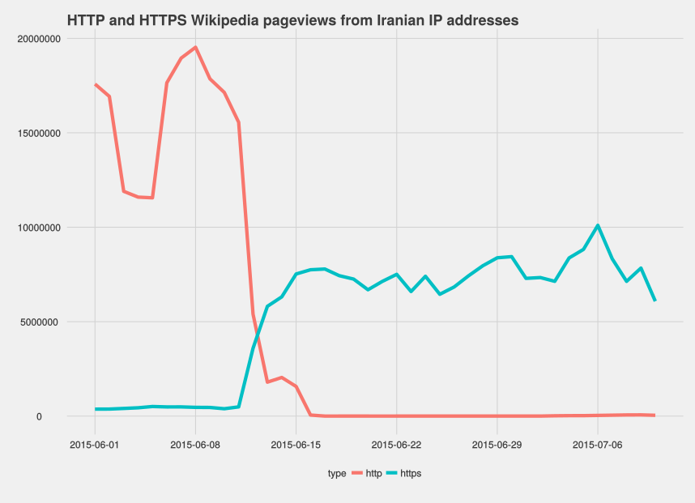
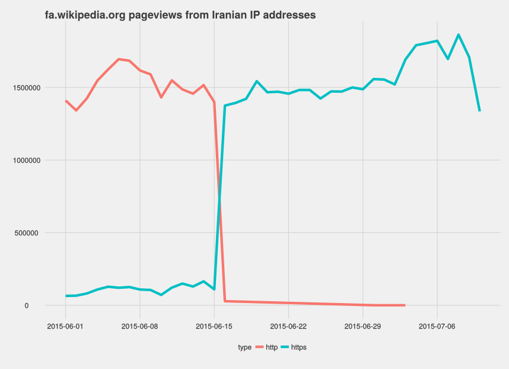
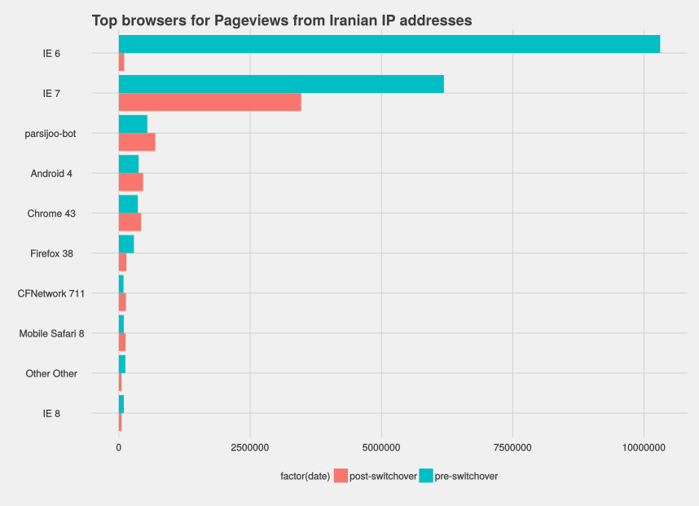
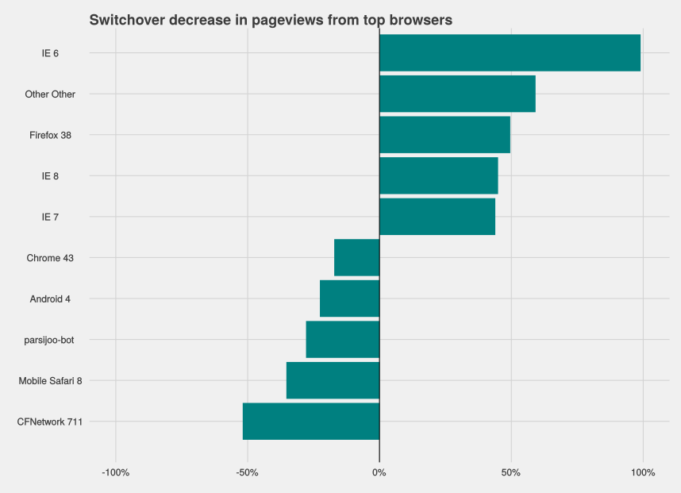

June/July Iranian Traffic Drop
========================================================
author: Oliver Keyes
date: 2015-07-13

Summary
========================================================

To understand the decrease in traffic following the HTTPS switchover, we conducted a detailed analysis, including user agent parsing, of pageviews and search events directed at our servers from Iranian IP addresses. We found that:

* The HTTP/S switchover is almost certainly the cause of the massive traffic decrease;
* The drop in pageviews is mimicked by a drop in search events;
* It is disproportionately affecting older browsers, which make up the vast majority of Iran's use of Wikipedia;
* While browser age is a massive factor, there are some indications that modern browsers do not immunise a user from being halted, suggesting that both software issues and some amount of official firewalling is going on.

Pageviews
========================================================

To analyse pageviews we took all traffic from Iran identified as pageviews in the months of June and July 2015.

A massive drop in traffic is scene between 12 June and 17 June 2015, which aligns with the date of the HTTPS switchover.

The drop is even more prominent on the Farsi-language projects, where almost all traffic originating in Iran vanishes. One hypothesis as to why this is more prominent is demographic differences; users who primarily use the Farsi language Wikipedia are likely to be users without English-language skills, which has implications for their socio-economic status - something that in *turn* has implications for the modernity of their hardware and software, and how they access the internet.

Browsers
========================================================

The timing and nature of the drop clearly indicates that the HTTP -> HTTPS switch is responsible, but that doesn't (on its own) indicate what we can do about it. It could be that Iran is firewalling and intercepting HTTPS traffic in a lot of places, or it could be that browsers don't support it well. To answer which it is, we retrieved 2 days of user agents (8 June 2015, pre-switchover, and 8 July 2015, post-switchover) and parsed them using the [https://github.com/tobie/ua-parser](ua-parser) toolkit.

If we look at the most prominent pre-switchover browsers and major versions, and see how they're doing post-switchover, we can get a good idea of if the drop is evenly distributed (indicating blocking) or unevently distributed in the direction of older browsers (indicating that support is the problem).

What we see is that the decrease in traffic is massively variable and seems to hit older browsers, such as IE6, the most. Another way of looking at this is by examining the *proportional* decrease - what percentage traffic is lost after the switchover? The higher the number, the greater the loss. 100% would indicate traffic was entirely eliminated, while -100% would indicate traffic doubled.

What we see is further evidence that the loss is grossly disproportionate. IE6, responsible for the vast majority of traffic from Iranian IP addresses, loses 99% of use. IE7, the next biggest competitor, loses 45%. Particularly interesting, though, is that Firefox 38, a fairly modern browser, *also* loses a share, suggesting that there is an element of blocking involved.

Search
========================================================
